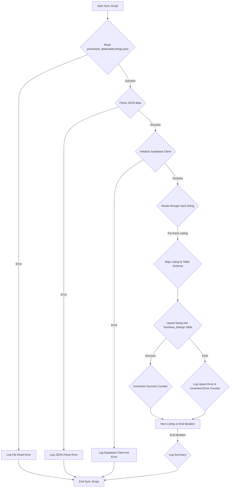

# Automated Data Syncing: JSON to Supabase

This document outlines the design for automatically syncing processed business listing data from `processed_data/validListings.json` into a Supabase database.

## 1. Proposed Supabase Table Schema

**Table Name:** `business_listings`

**Columns:**

| Column Name                | Supabase Data Type | Nullable | Default Value | Notes                                                                 |
| :------------------------- | :----------------- | :------- | :------------ | :-------------------------------------------------------------------- |
| `id`                       | `TEXT`             | NOT NULL |               | Primary Key. Maps to `BusinessListing.id`.                            |
| `name`                     | `JSONB`            | NOT NULL |               | Maps to `BusinessListing.name` (`TypedText` object).                  |
| `formatted_address`        | `TEXT`             | NOT NULL |               | Maps to `BusinessListing.formattedAddress`.                           |
| `address_components`       | `JSONB`            | NOT NULL |               | Maps to `BusinessListing.addressComponents` (array of `AddressComponent`). |
| `location`                 | `JSONB`            | NOT NULL |               | Maps to `BusinessListing.location` (`Location` object).               |
| `website_uri`              | `TEXT`             | YES      | `NULL`        | Maps to `BusinessListing.websiteUri`.                                 |
| `adr_format_address`       | `TEXT`             | YES      | `NULL`        | Maps to `BusinessListing.adrFormatAddress`.                           |
| `business_status`          | `TEXT`             | YES      | `NULL`        | Maps to `BusinessListing.businessStatus`.                             |
| `price_level`              | `TEXT`             | YES      | `NULL`        | Maps to `BusinessListing.priceLevel`.                                 |
| `primary_type_display_name`| `JSONB`            | YES      | `NULL`        | Maps to `BusinessListing.primaryTypeDisplayName` (`TypedText` object). |
| `current_opening_hours`    | `JSONB`            | YES      | `NULL`        | Maps to `BusinessListing.currentOpeningHours` (`BusinessHours` object). |
| `primary_type`             | `TEXT`             | YES      | `NULL`        | Maps to `BusinessListing.primaryType`.                                |
| `price_range`              | `JSONB`            | YES      | `NULL`        | Maps to `BusinessListing.priceRange` (`PriceRange` object).           |
| `national_phone_number`    | `TEXT`             | YES      | `NULL`        | Maps to `BusinessListing.nationalPhoneNumber`.                        |
| `international_phone_number`| `TEXT`             | YES      | `NULL`        | Maps to `BusinessListing.internationalPhoneNumber`.                   |
| `category`                 | `TEXT`             | YES      | `NULL`        | Maps to `BusinessListing.category`.                                   |
| `subcategory`              | `TEXT`             | YES      | `NULL`        | Maps to `BusinessListing.subcategory`.                                |
| `description`              | `TEXT`             | YES      | `NULL`        | Maps to `BusinessListing.description`.                                |
| `images`                   | `TEXT[]`           | YES      | `NULL`        | Maps to `BusinessListing.images` (array of URLs).                     |
| `verified`                 | `BOOLEAN`          | YES      | `NULL`        | Maps to `BusinessListing.verified`.                                   |
| `rating`                   | `FLOAT8`           | YES      | `NULL`        | Maps to `BusinessListing.rating`.                                     |
| `review_count`             | `INTEGER`          | YES      | `NULL`        | Maps to `BusinessListing.reviewCount`.                                |
| `created_at`               | `TIMESTAMPTZ`      | YES      | `now()`       | Maps to `BusinessListing.createdAt`. Auto-set on creation.            |
| `updated_at`               | `TIMESTAMPTZ`      | YES      | `now()`       | Maps to `BusinessListing.updatedAt`. Auto-set on update.              |
| `raw_json_data`            | `JSONB`            | YES      | `NULL`        | Optional: To store the original JSON object for auditing/debugging.   |

**Primary Key:**
*   `id`

**Initial Important Indexes:**
*   **Primary Key Index:** Automatically created on `id`.
*   **`category`:** If listings are frequently filtered or queried by `category`.
    ```sql
    CREATE INDEX idx_business_listings_category ON business_listings (category);
    ```
*   **`location` (Geospatial):** If geospatial queries are planned (e.g., find listings within a certain radius). Supabase uses PostGIS, so a GIST index on a `GEOGRAPHY` or `GEOMETRY` type column would be appropriate. For now, with `JSONB`, we can index specific paths if needed, or consider a separate table/column for optimized geo-queries later. For simplicity with `JSONB`, we can start without a specific geo-index on the `location` JSONB column itself, but if performance becomes an issue for location-based searches, we would revisit this to potentially extract latitude/longitude into separate `FLOAT8` columns and create a PostGIS spatial index.
    A simpler index on the `JSONB` column for `location` might look like this if we frequently query by, for example, latitude (though less efficient than a true PostGIS index):
    ```sql
    CREATE INDEX idx_business_listings_location_lat ON business_listings USING GIN ((location->'latitude'));
    ```
*   **`primary_type`:** If listings are frequently filtered by their primary type.
    ```sql
    CREATE INDEX idx_business_listings_primary_type ON business_listings (primary_type);
    ```

**Notes on `JSONB` columns:**
*   `name`: Stores the `TypedText` object (`{ text: "...", languageCode: "..." }`).
*   `address_components`: Stores an array of `AddressComponent` objects.
*   `location`: Stores the `Location` object (`{ latitude: ..., longitude: ... }`).
*   `primary_type_display_name`: Stores the `TypedText` object.
*   `current_opening_hours`: Stores the `BusinessHours` object.
*   `price_range`: Stores the `PriceRange` object.

## 2. Syncing Script Logic (`scripts/sync-to-supabase.mjs`)

This script will handle reading the JSON data and upserting it into the Supabase `business_listings` table.



**Steps:**

1.  **Import necessary modules:**
    *   `fs` (Node.js file system module) for reading the JSON file.
    *   Supabase client from `src/supabase/client.ts`.
    *   (Optional) A logging library if more advanced logging is needed.

2.  **Define Constants:**
    *   `JSON_FILE_PATH`: Path to `processed_data/validListings.json`.
    *   `SUPABASE_TABLE_NAME`: `'business_listings'`.

3.  **Main Sync Function (`async function syncListings()`):**
    *   **a. Read JSON File:**
        *   Use `fs.readFile` or `fs.readFileSync` to read the content of `JSON_FILE_PATH`.
        *   Wrap in a `try...catch` block to handle file read errors (e.g., file not found).
        *   Parse the JSON content using `JSON.parse()`. Wrap in `try...catch` for JSON parsing errors.
        *   If errors occur, log them and exit or return an error status.

    *   **b. Connect to Supabase:**
        *   The Supabase client from `src/supabase/client.ts` should already be configured. Ensure it's correctly initialized.

    *   **c. Iterate and Upsert:**
        *   Initialize counters: `successfulUpserts = 0`, `failedUpserts = 0`.
        *   Loop through each `listing` object in the parsed JSON array.
        *   **d. Perform Upsert:**
            *   For each `listing`:
                *   **e. Map Fields:** Create an object (`recordToUpsert`) that maps the `BusinessListing` fields to the `business_listings` table columns.
                    *   `id`: `listing.id`
                    *   `name`: `listing.name` (will be stored as JSONB)
                    *   `formatted_address`: `listing.formattedAddress`
                    *   `address_components`: `listing.addressComponents` (will be stored as JSONB)
                    *   `location`: `listing.location` (will be stored as JSONB)
                    *   `website_uri`: `listing.websiteUri || null`
                    *   `adr_format_address`: `listing.adrFormatAddress || null`
                    *   `business_status`: `listing.businessStatus || null`
                    *   `price_level`: `listing.priceLevel || null`
                    *   `primary_type_display_name`: `listing.primaryTypeDisplayName || null` (JSONB)
                    *   `current_opening_hours`: `listing.currentOpeningHours || null` (JSONB)
                    *   `primary_type`: `listing.primaryType || null`
                    *   `price_range`: `listing.priceRange || null` (JSONB)
                    *   `national_phone_number`: `listing.nationalPhoneNumber || null`
                    *   `international_phone_number`: `listing.internationalPhoneNumber || null`
                    *   `category`: `listing.category || null`
                    *   `subcategory`: `listing.subcategory || null`
                    *   `description`: `listing.description || null`
                    *   `images`: `listing.images || null` (array of text)
                    *   `verified`: `listing.verified || null`
                    *   `rating`: `listing.rating || null`
                    *   `review_count`: `listing.reviewCount || null`
                    *   `created_at`: If `listing.createdAt` exists, use it. Otherwise, Supabase default will apply. For upserts, `updated_at` will be managed by Supabase triggers or script logic if needed (though `now()` default is good).
                    *   `updated_at`: Can be explicitly set to `new Date().toISOString()` or rely on Supabase's default `now()` if the table is configured with an `updated_at` column that auto-updates.
                    *   `raw_json_data`: `listing` (store the whole original object if this column is included).
                *   Use the Supabase client's `upsert` method:
                    ```javascript
                    const { data, error } = await supabase
                        .from(SUPABASE_TABLE_NAME)
                        .upsert(recordToUpsert, {
                            onConflict: 'id', // Specify the conflict target (primary key)
                            // ignoreDuplicates: false by default, which is what we want for upsert
                        })
                        .select(); // Optionally select to get the upserted record back
                    ```
                *   **f. Error Handling:**
                    *   Check if `error` exists.
                    *   If an error occurs, log the error details (e.g., `error.message`, the `listing.id` that failed) and increment `failedUpserts`.
                    *   Consider what to do on error: continue with next record, or stop the script? For a batch sync, usually log and continue.
                *   If successful, increment `successfulUpserts`.
        *   **g. Logging:**
            *   After the loop, log a summary:
                *   Total records processed: `parsedJsonData.length`.
                *   Successfully upserted: `successfulUpserts`.
                *   Failed upserts: `failedUpserts`.
            *   Log any specific error messages collected during the process.

4.  **Execute the main function:**
    *   Call `syncListings()`.
    *   Handle any top-level promise rejections from `syncListings()`.

**Example Snippet for Field Mapping (Conceptual):**
```javascript
// Inside the loop
const recordToUpsert = {
  id: listing.id,
  name: listing.name, // Directly assign the object for JSONB
  formatted_address: listing.formattedAddress,
  address_components: listing.addressComponents, // Directly assign array of objects for JSONB
  location: listing.location, // Directly assign object for JSONB
  website_uri: listing.websiteUri || null,
  // ... other direct string/number/boolean mappings
  primary_type_display_name: listing.primaryTypeDisplayName || null, // JSONB
  current_opening_hours: listing.currentOpeningHours || null, // JSONB
  price_range: listing.priceRange || null, // JSONB
  images: listing.images || null, // TEXT[]
  // For timestamps, ensure they are in a format Supabase accepts (ISO string)
  // created_at and updated_at might be handled by DB defaults or triggers
  // raw_json_data: listing, // If including this column
};
```

## 3. Automation Considerations

*   **Manual Execution (npm script):**
    *   Add a script to `package.json`:
        ```json
        "scripts": {
          // ... other scripts
          "sync:supabase": "node ./scripts/sync-to-supabase.mjs"
        }
        ```
    *   Run manually via `npm run sync:supabase`. This is the immediate goal.
*   **Scheduled Task (Cron Job / GitHub Actions):**
    *   For full automation, the script could be triggered by a cron job on a server.
    *   Alternatively, use a CI/CD pipeline (like GitHub Actions) to run the script on a schedule (e.g., daily) or after the `process-listings.mjs` script successfully completes and updates `validListings.json`.
*   **Serverless Function:**
    *   The logic could be adapted into a serverless function (e.g., Supabase Edge Functions, AWS Lambda) triggered by an event (e.g., file upload to storage, HTTP request) or on a schedule.

The immediate focus is to create the `sync-to-supabase.mjs` script that can be run manually.